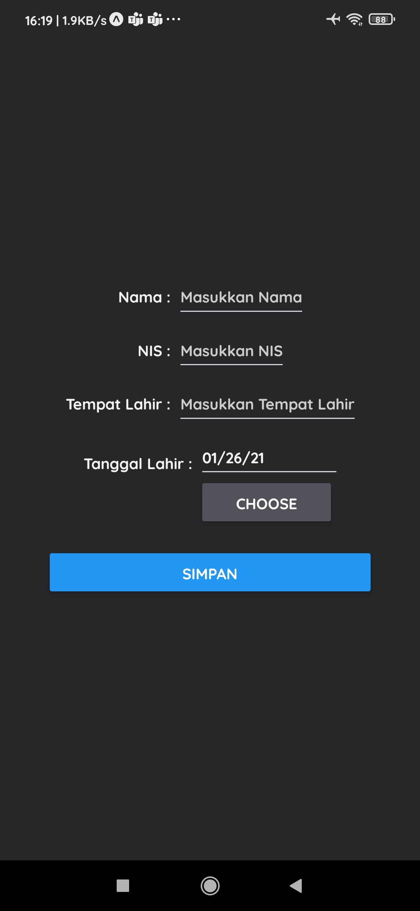
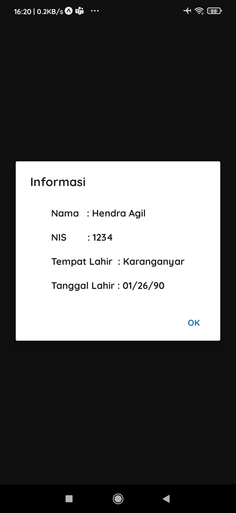

# Simple Input With Expo

| Preview 1                          | Preview 2                          |
| ---------------------------------- | ---------------------------------- |
|  |  |

## How to run

1. Clone this project <br>
   `git clone https://github.com/erpeel-a/SimpleInputExpo.git`
2. Install all dependencies <br>
   ```
   cd SimpleInputExpo
   yarn install
   ```
3. Run this app <br>
   `yarn start` or `expo start`

## Learn More

- [Expo Documentation](https://docs.expo.io/)
- [React Native Documentation](https://reactnative.dev/)
